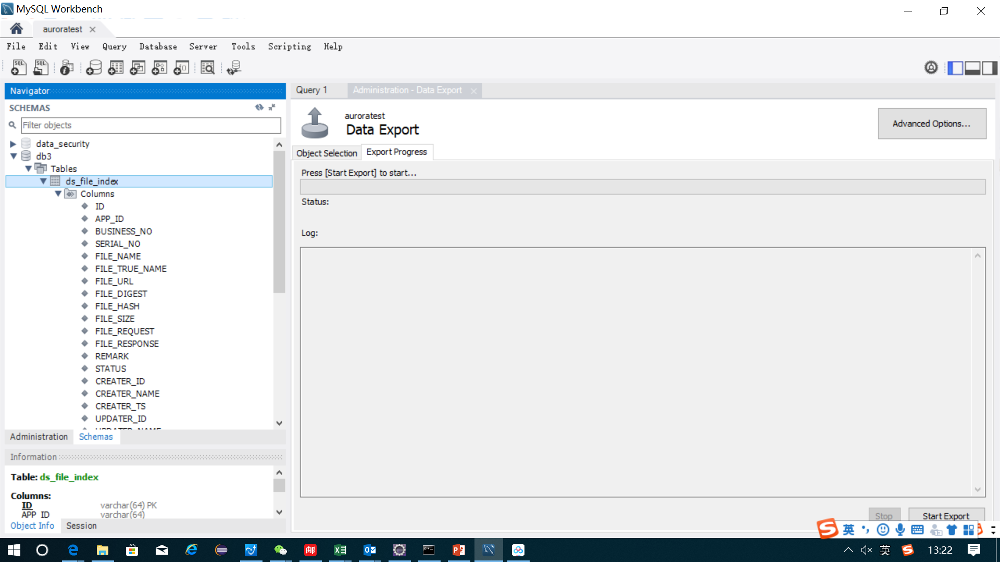
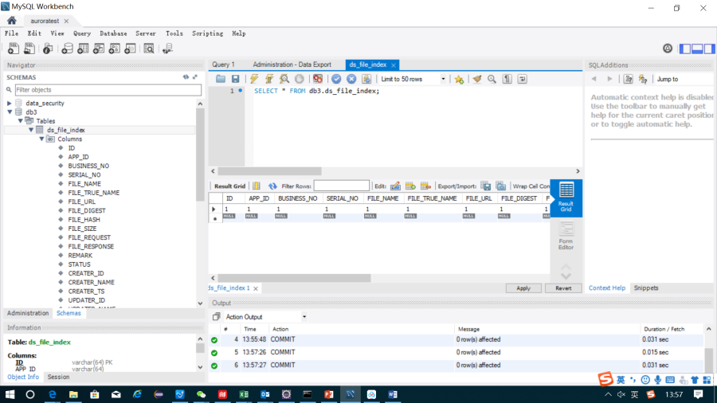
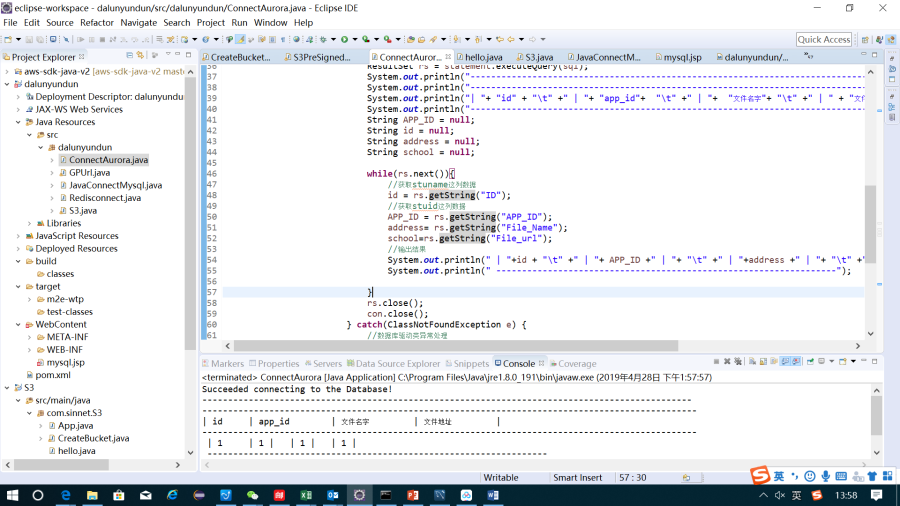

<p class="description">Aurora是Amazon在2014 AWS re:Invent大会上推出的一款全新关系数据库，提供商业级的服务可用性和数据可靠性，相比MySQL有5倍的性能提升，并基于RDS 提供自动化运维和管理。本文介绍了使用Java访问Aurora Mysql数据的方法</p>

<!--  -->

<!-- more -->

**作者：光环云  马立刚**  

#### Java 访问Aurora
以下是使用mysql-connector 连接Aurora for mysql参考示例：

Workbench 访问Aurora，跟mysql方式一致，如： 
Aurora.example.rds.cn-northwest-1.amazonaws.com.cn  
用户名：root  
密码：root


<!--  -->

Eclipse 开发首先在maven添加依赖，如下：  
```
<dependency>
    <groupId>mysql</groupId>
    <artifactId>mysql-connector-java</artifactId>
    <version>8.0.15</version>
</dependency>
```

源代码：  
```
package Aurora.test;
import java.sql.Connection;
import java.sql.DriverManager;
import java.sql.ResultSet;
import java.sql.SQLException;
import java.sql.Statement;
public class ConnectAurora {
	public static void main(String[] args) {
		// TODO Auto-generated method stub
				        //声明Connection对象
				        Connection con;
				        String driver = "com.mysql.cj.jdbc.Driver";
				        //URL指向要访问的数据库名mydata
				        String url = "jdbc:mysql:// Aurora.example.rds.cn-northwest-1.amazonaws.com.cn:3306/db3";
				        //MySQL配置时的用户名
				        String user = "root";
				        //MySQL配置时的密码
				        String password = "root";
				        //遍历查询结果集
				        try {
				            //加载驱动程序
				            Class.forName(driver);
				            //1.getConnection()方法，连接MySQL数据库！！
				            con = DriverManager.getConnection(url,user,password);
				            if(!con.isClosed())
				                System.out.println("Succeeded connecting to the Database!");
				            //2.创建statement类对象，用来执行SQL语句！！
				            Statement statement = con.createStatement();
				            //要执行的SQL语句
				            String sql = "select * from fileindex";
				            //3.ResultSet类，用来存放获取的结果集！！
				            ResultSet rs = statement.executeQuery(sql);
				            System.out.println("-----------------------------------------------------------------------------------------------");		         
				            System.out.println("------------------------------------------------------------------------------------------------");  
				            System.out.println("| "+ "id" + "\t" +" | "+ "app_id"+  "\t" +" | "+  "文件名字"+ "\t" +" | " + "文件地址"+ "\t" +" | ");  
				            System.out.println("------------------------------------------------------------------------------------------------");  			             
				            String APP_ID = null;
				            String id = null;
				            String address = null;
				            String school = null;
				            while(rs.next()){
				                //获取stuname这列数据
				                id = rs.getString("ID");
				                //获取stuid这列数据
				                APP_ID = rs.getString("APP_ID");
		                        address= rs.getString("File_Name");
		                        school=rs.getString("File_url");
				                //输出结果
				                System.out.println(" | "+id + "\t" +" | "+ APP_ID +" | "+ "\t" +" | "+address +" | "+ "\t" +" | "+school +" | " );
				                System.out.println(" ------------------------------------------------------------------");  
				            }
				            rs.close();
				            con.close();
				        } catch(ClassNotFoundException e) {   
				            //数据库驱动类异常处理
				            System.out.println("Sorry,can`t find the Driver!");   
				            e.printStackTrace();   
				            } catch(SQLException e) {
				            //数据库连接失败异常处理
				            e.printStackTrace();  
				            }catch (Exception e) {
				            // TODO: handle exception
				            e.printStackTrace();
				        }finally{
				           System.out.println("数据库数据成功获取！");
				        }
				    }

}
```

Workbench 查询：  



Java 查询结果：  

  
****
**关于光环云**  
光环云是AWS服务在华推广机构，是一家由光环新网组建的独立业务部门公司。它开发、组建、运营一个全国的云生态系统，以促进、支持AWS服务广大客户，包括开发者、初业创公司、互联网企业、社会与政府机构，以及ICT服务商。

**关于光环云社群**  
光环云社群是光环云生态伙伴计划，致力于与推广者实现普惠科技，以社会化营销驱动云端生态。
加入光环云社群后将获得AWS产品推广返现、AWS认证优惠、技术文章获取等特权，并得到光环云多项权益赋能支持。


微信搜索“光环云社群”或扫描下方二维码，获取更多资讯。

   

最终解释权归光环云数据有限公司！